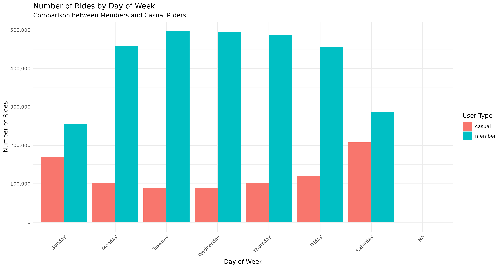
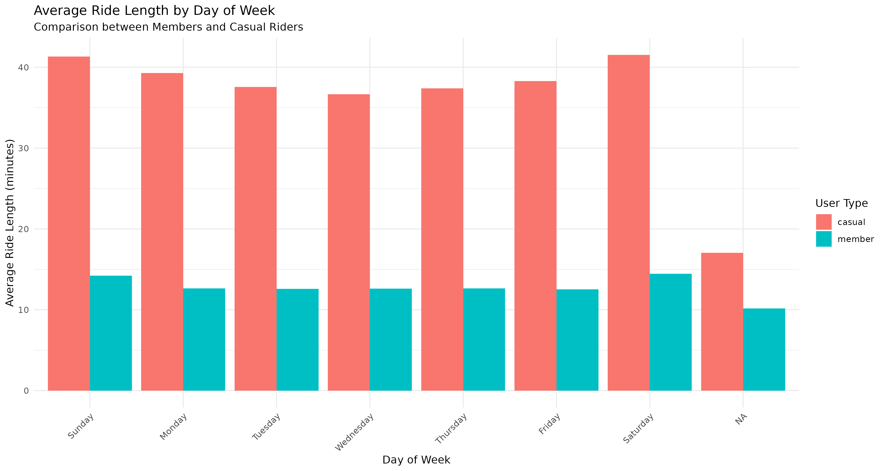
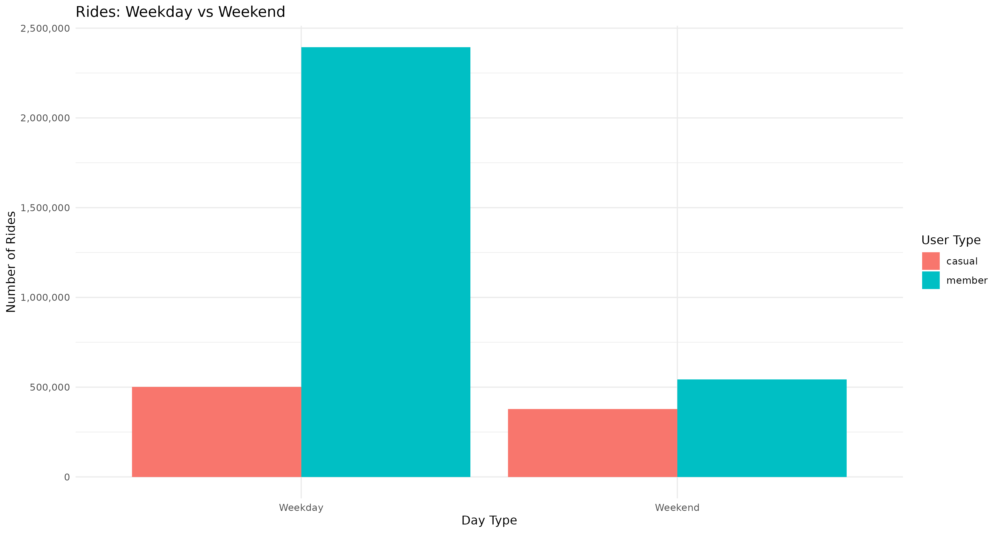
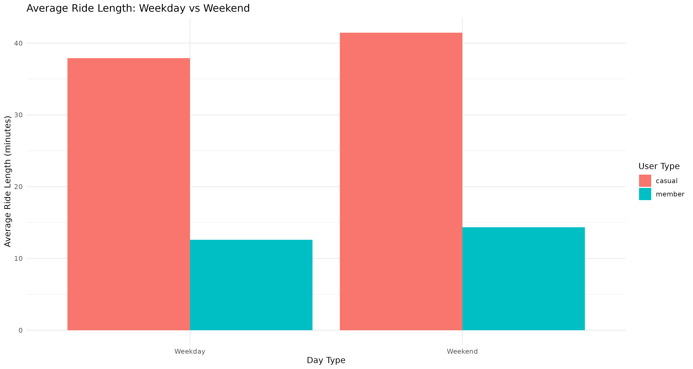
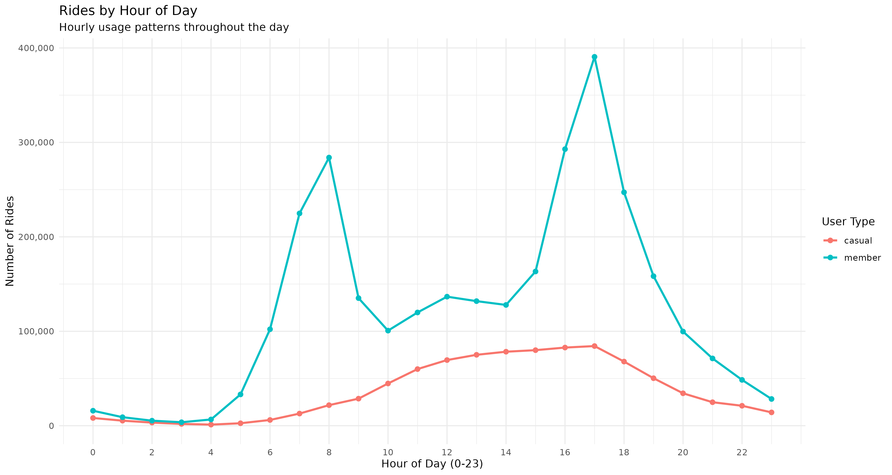
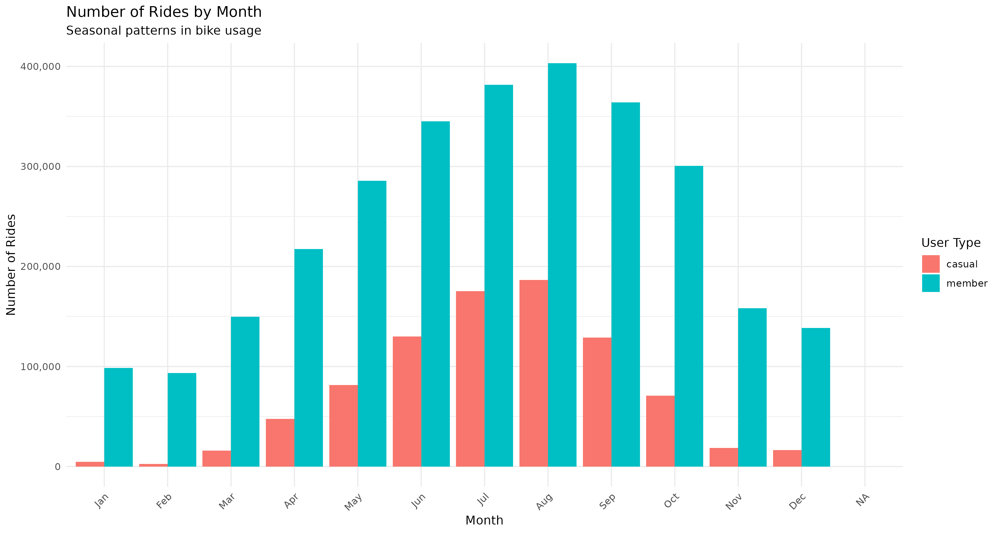
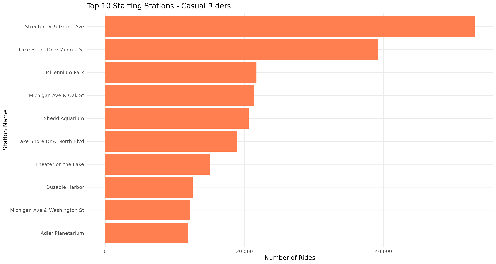
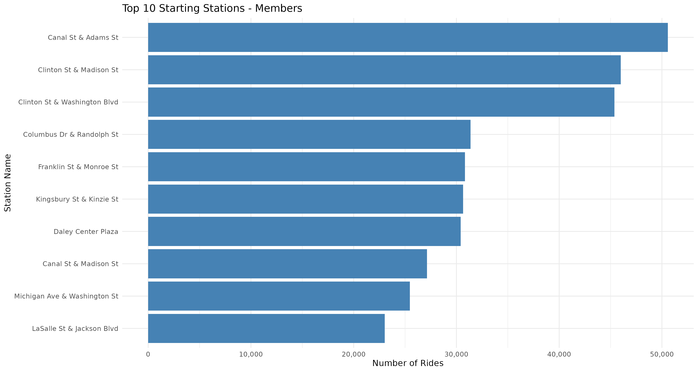
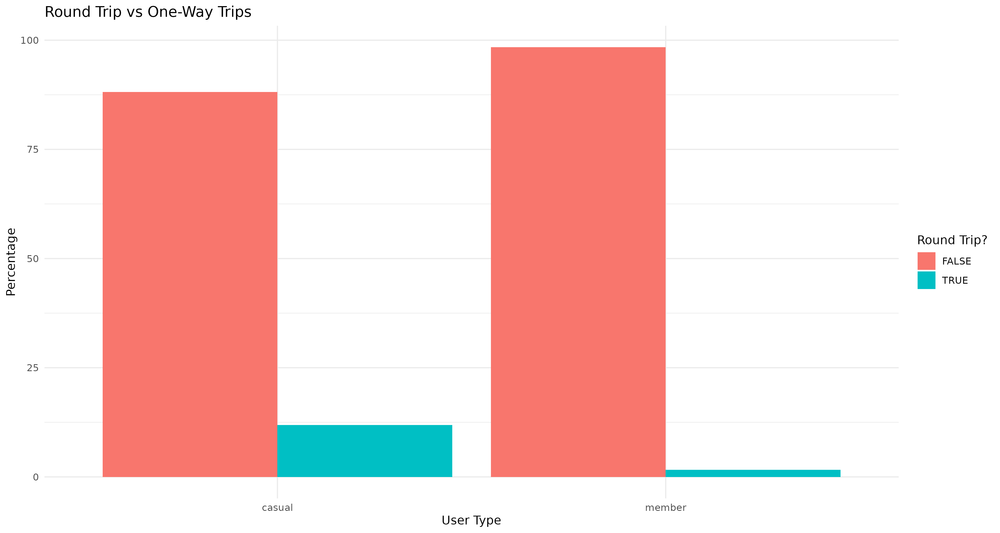

# Google Data Analytics Capstone: Cyclistic Bike-Share Analysis

## Project Overview
This is my capstone project for the Google Data Analytics Professional Certificate. I'm taking on the role of a junior data analyst at Cyclistic, a Chicago-based bike-share company, working on the marketing analytics team.

## Objective
The marketing director wants to understand how casual riders and annual members use Cyclistic bikes differently. My analysis will help inform a new marketing strategy aimed at converting casual riders into annual members.

## Methodology
I'm following the structured six-step data analysis process:

Ask - Define the business question
Prepare - Collect and organize data
Process - Clean and transform data
Analyze - Identify patterns and insights
Share - Create visualizations and present findings
Act - Develop actionable recommendations


## Data Source
The trip data is downloaded from [Divvy Trip Data](https://divvy-tripdata.s3.amazonaws.com/index.html) (publicly available historical bike trip data provided by Motivate International Inc.).

## What's included in this repository

### Analysis Implementations

This project includes two complete analysis implementations:

#### 1. R Analysis (Tidyverse)
- Complete data analysis using R and the Tidyverse package
- Includes data cleaning, transformation, and visualization
- Available as Jupyter notebook: [divvy-cyclistic-bike-trip-data-analysis-with-r.r](divvy-cyclistic-bike-trip-data-analysis-with-r.r)
- [View on Kaggle](https://www.kaggle.com/code/mohammadbagherehtemam/divvy-cyclistic-bike-trip-data-analysis-with-r)

#### 2. SQL Analysis (SQLite)
- Complete data analysis using SQL with SQLite database
- Mirrors the R analysis workflow using SQL queries
- Location: [sql/](sql/) directory
- Includes:
  - Database schema creation
  - Data import and cleaning scripts
  - Comprehensive analysis queries
  - Export scripts for visualization
  - Automated pipeline script
- See [sql/README.md](sql/README.md) for detailed documentation

### Quick Start (SQL Analysis)

```bash
# Navigate to the SQL directory
cd sql

# Run the complete analysis pipeline
./run_analysis.sh
```

The automated script will:
1. Check prerequisites
2. Create the database schema
3. Import all quarterly data files
4. Clean and transform the data
5. Run all analysis queries
6. Export results to CSV files

For detailed instructions, see the [SQL README](sql/README.md).

## Key Findings

### Business Question
**How do annual members and casual riders use Cyclistic bikes differently?**

Based on analysis of 3.8 million trips from 2019 using R (tidyverse, ggplot2), I found that annual members and casual riders use Cyclistic bikes for fundamentally different purposes.

### Main Finding
Members and casual riders use bikes for different purposes:
- **Members (77% of rides)**: Short weekday trips for commuting
- **Casual riders (23% of rides)**: Longer weekend trips for leisure

### Detailed Findings

#### 1. Ride Duration
**Data:**
- Casual riders: 38-42 minutes average
- Members: 12-14 minutes average

**Observation:** Casual riders take 3x longer trips, suggesting they're exploring and enjoying the ride, while members are getting from point A to B quickly.

#### 2. Day of Week Patterns
**Weekday vs Weekend Split:**
- **Members:** 2,393,601 weekday rides (81%) vs 543,258 weekend rides (19%)
- **Casual:** 501,592 weekday rides (57%) vs 377,692 weekend rides (43%)

**Busiest Days:**
- **Members:** Tuesday (496,951), Wednesday (494,205), Thursday (486,837)
- **Casual:** Saturday (207,758), Sunday (169,934)

**Interpretation:** Members show commuting behavior with peak weekday usage, while casual riders favor weekends for recreational use.









#### 3. Time of Day Patterns
**Members:**
- Clear morning peak around 8 AM (~280,000 rides)
- Evening peak around 5 PM (~390,000 rides)
- Classic "M" shape commute pattern

**Casual Riders:**
- Gradual increase throughout the day
- Peak in late afternoon around 5 PM (~85,000 rides)
- More evenly distributed usage

**Interpretation:** Members use bikes for structured commuting, while casual riders have flexible, leisure-based timing.



#### 4. Seasonal Patterns
**Casual Riders (Highly Seasonal):**
- Peak: August (186,624 rides)
- Lowest: February (2,627 rides)
- 98% drop from peak to lowest month

**Members (Year-Round Consistent):**
- Maintain 100,000-400,000 rides throughout the year
- Less dramatic seasonal variation

**Interpretation:** Casual riders are fair-weather users who view bikes as a summer activity, while members rely on bikes year-round for transportation.



#### 5. Station Locations

**Top Casual Rider Stations (Tourist/Recreation):**
- Streeter Dr & Grand Ave (53,071) - Near Navy Pier
- Lake Shore Dr & Monroe St (39,209) - Lakefront
- Millennium Park (21,728) - Tourist spot
- Shedd Aquarium (20,609) - Tourist attraction

**Top Member Stations (Business/Transit):**
- Canal St & Adams St (50,569) - Downtown Loop
- Clinton St & Madison St (45,986) - West Loop/Transit
- Clinton St & Washington Blvd (45,375) - West Loop
- Daley Center Plaza (30,420) - Downtown

**Interpretation:** Location data reinforces different use cases - casual riders concentrate at tourist areas, members spread across business districts.





#### 6. Round Trips
- **Casual riders:** 11.9% round trips (104,452 out of 879,284)
- **Members:** 1.6% round trips (47,533 out of 2,936,859)

**Interpretation:** Casual riders do more "there and back" recreational trips, while members focus on point-to-point transportation.



### Summary: Members vs Casual Riders

| Factor | Members | Casual Riders |
|--------|---------|---------------|
| **Purpose** | Daily commuting & transportation | Leisure & recreation |
| **Trip Length** | 12-14 minutes (short, efficient) | 38-42 minutes (long, exploratory) |
| **Peak Days** | Weekdays (81% of trips) | Weekends (43% of trips) |
| **Time Pattern** | Rush hour peaks (8 AM, 5 PM) | Spread throughout day |
| **Seasonality** | Year-round consistent usage | Highly seasonal (summer peak) |
| **Locations** | Business districts & transit hubs | Tourist attractions & lakefront |
| **Trip Type** | 98.4% one-way trips | 11.9% round trips |
| **Volume** | 2.9M rides (77%) | 879K rides (23%) |

### Answer to Business Question

Annual members use Cyclistic as **everyday transportation**, taking short trips (12-14 minutes) during weekday rush hours between business districts and transit hubs. Their usage is consistent year-round, with 98.4% one-way trips.

Casual riders use Cyclistic for **weekend recreation**, taking longer trips (38-42 minutes) with peak usage on weekends and during summer months. They concentrate at tourist attractions and lakefront areas, with usage dropping 98% in winter.

**Key Insight:** Casual riders already enjoy using Cyclistic bikes - they're just using them differently than members. The opportunity for conversion lies in helping casual riders see that bikes can be more than just weekend fun - they can also be a practical, cost-effective solution for everyday transportation needs.